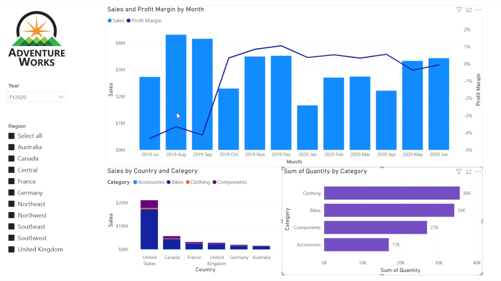

# Adventure Works – Power BI Sales & Analytics Dashboard

## Project Overview
This Power BI dashboard was created as part of a hands-on technical lab using the **Adventure Works** dataset. The goal of this dashboard is to provide actionable business insights into sales performance, profit margins, customer demographics, and product trends.

---

## Key Features & Technical Details

* **Data Modeling:** Modeled relational data by connecting sales, product categories, and customer region tables.
* **DAX & Metrics:** Created explicit measures for total revenue, profit margins, sales per categories and year-to-year performance.
* **Interactive Design:** Applied custom branding using the CY24 core theme and interactive slicers.

---

## Dashboard Demonstration

---

## How to View This Report

1. Clone or download this repository.
2. Make sure you have **Power BI Desktop** installed.
3. Open `AW_Dashboard_Demo.pbix` to explore the interactive report.
